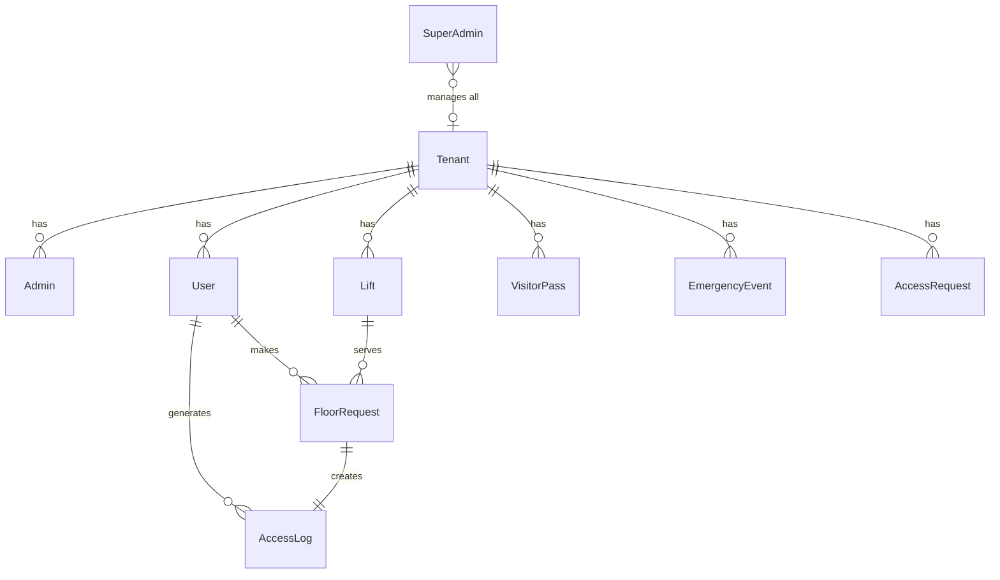

# SmartLift — System Architecture & Explanation

## One-Line Summary

**SmartLift is an intelligent Elevator Authentication System that recognizes users via facial recognition 👤 or QR code 📱, then enforces role-based access control for floor selection.**

---

## The Big Picture (Simplified)

```
User approaches the lift
    ↓
Camera detects FACE 👁️ (or scans QR code)
    ↓
System checks: "Is this user registered in the database?" 🤔
    ↓
YES → "Which floor?" → Checks allowed floors (RBAC) → Lift dispatches 🛗
NO  → "Access Denied." 🚫
```

---

## 🧱 How the Project is Built (Core Components)

| File | What It Does | How You Run It |
|---|---|---|
| **`app.py`** | The **WEB DASHBOARD** — a centralized interface where admins manage users, view access logs, and approve visitors. | `python app.py` → opens at `localhost:8000` |
| **`main.py`** | The **EDGE NODE** — the physical lift controller that handles real-time camera/microphone authentication. | `python main.py` → activates webcam/hardware |

> [!IMPORTANT]
> These two programs share the **same database** (`instance/smartlift_saas.db`). This ensures that when an administrator registers a user on the dashboard, the Edge Node (`main.py`) instantly recognizes them without delay.

---

## 🏗️ Architecture — The Folder Map

```
SmartLift/
├── app.py                  ← 🌐 Web dashboard (Flask server on port 8000)
├── main.py                 ← 📹 Physical lift controller (camera + voice)
├── edge_node_config.json   ← 🔗 Tells main.py which Tenant to serve
├── seed_demo_data.py       ← 🌱 Fills DB with fake demo data
│
├── software/               ← 💾 DATABASE LAYER
│   ├── models.py           ← ⭐ ALL DATABASE TABLES DEFINED HERE
│   └── faiss_engine.py     ← 🧠 FAISS vector search (DeepFace AI)
│
├── hardware/               ← ⚙️ PHYSICAL HARDWARE LAYER
│   ├── camera_face_recognition.py  ← 👁️ Face recognition + QR scanner
│   ├── lift_hardware_controller.py ← 🛗 Sends "GOTO:3" to Arduino/relay
│   └── voice_control_module.py     ← 🎙️ Text-to-speech + voice commands
│
├── instance/
│   └── smartlift_saas.db   ← 🗄️ THE ACTUAL DATABASE FILE (SQLite)
│
├── templates/              ← 🖥️ HTML pages for the web dashboard
├── static/                 ← 🎨 CSS, images, QR code images
│   └── registered_faces/   ← 📸 Face photos of enrolled users
└── requirements.txt        ← 📦 Python packages needed
```

---

## 🗄️ WHERE USERS ARE STORED — The Full Breakdown

### The Database File

```
instance/smartlift_saas.db    ← This is it. ONE file. SQLite database.
```

Everything lives in this single `.db` file. It's configured in `app.py`:
```python
app.config['SQLALCHEMY_DATABASE_URI'] = 'sqlite:///smartlift_saas.db'
```

### All 9 Database Tables

All tables are defined in [models.py](software/models.py):



---

### 🏫 Table 1: `Tenant` — The Institution/College

> Think of this as: **"Which building is this lift installed in?"**

| Column | What It Stores | Example |
|---|---|---|
| `id` | Unique ID | `1` |
| `name` | College/company name | `"Demo University"` |
| `clg_id` | College registration ID | `"DU2024"` |
| `No_Floor` | How many floors the building has | `10` |
| `max_lifts` | How many lifts are allowed | `5` |
| `primary_color` | Brand color for dashboard | `"#3b82f6"` |
| `subscription_status` | Is this tenant paying? | `"Active"` or `"Suspended"` |
| `subscription_type` | What plan they're on | `"Enterprise"` / `"Premium"` |

> [!NOTE]
> If a Tenant's status is `"Suspended"`, the physical lift **refuses to boot**! (See `main.py` line 114-121)

---

### 👑 Table 2: `SuperAdmin` — The God Account (System Founders)

| Column | What It Stores | Example |
|---|---|---|
| `id` | Unique ID | `1` |
| `email` | Login email | `"founder@smartlift.com"` |
| `password` | Hashed password | `pbkdf2:sha256:...` |

**Default credentials** (auto-created on first run):
- **Email:** `founder@smartlift.com`
- **Password:** `founder123`

SuperAdmin can: add/remove Tenants, suspend subscriptions, manage everything.

---

### 🔐 Table 3: `Admin` — The College Administrator

| Column | What It Stores | Example |
|---|---|---|
| `admin_id` | Unique ID | `1` |
| `email` | Login email | `"admin@demo.com"` |
| `password` | Hashed password | `pbkdf2:sha256:...` |
| `tenant_id` | Which Tenant they belong to | `1` (→ Demo University) |

**Default demo admin:**
- **Email:** `admin@demo.com`
- **Password:** `admin123`

Each Admin is **locked to ONE tenant**. They can only see/manage users in their own building.

---

### ⭐ Table 4: `User` — THE MAIN USER TABLE (People who use the lift)

> [!IMPORTANT]
> This is the most important table. Every person who can use the lift is recorded here.

| Column | What It Stores | Example |
|---|---|---|
| `user_id` | Unique ID (auto-increment) | `42` |
| `name` | Full name | `"Aarav Sharma"` |
| `email` | Contact email | `"aarav.sharma@student.demo.edu"` |
| `Face_encoding` | **File path** to their face photo | `"static/registered_faces/t1_Aarav_Sharma.jpg"` |
| `face_vector` | **128-dimensional math vector** of their face (JSON array) | `"[0.034, -0.12, 0.56, ...]"` |
| `access_type` | Their role | `"Faculty"`, `"Temporary"` (student), `"Operator"` (staff), `"Disability"` |
| `allowed_floors` | Comma-separated floors they can visit | `"0,1,2,3"` |
| `access_start_time` | Earliest time they can use the lift | `09:00` |
| `access_end_time` | Latest time they can use the lift | `18:00` |
| `enrollment_id` | Student/employee ID (unique per tenant) | `"2023CS1005"` |
| `department` | Department name | `"Computer Science"` |
| `course` | Course name | `"B.Tech"` |
| `batch` | Year/batch | `"2023"` |
| `tenant_id` | Which building they belong to | `1` |

**Where the face photo lives on disk:**
```
static/registered_faces/
├── t1_Aarav_Sharma.jpg        ← Photo uploaded by admin
├── t1_Dr_Rajesh_Kumar.jpg
├── t1_Ravi_Maintenance.jpg
└── ...
```

**How face recognition works:**
1. Admin uploads a photo → saved to `static/registered_faces/`
2. AI extracts a 128-dimensional facial encoding → stored in the `face_vector` database column
3. User stands in front of the camera → AI extracts the live 128-dimensional encoding
4. The system compares the live encoding to all stored encodings using FAISS vector search
5. If the mathematical distance is close enough (match) → **Access Granted!** Otherwise → **Access Denied!**

---

### 📱 Table 5: `VisitorPass` — Temporary QR Code Passes

| Column | What It Stores | Example |
|---|---|---|
| `id` | Unique ID | `7` |
| `visitor_name` | Who the pass is for | `"[Guest] Amazon Delivery"` |
| `purpose` | Why they're visiting | `"Package Delivery"` |
| `qr_hash` | Unique secret code embedded in QR | `"SL-a3f8b2c1d4e5..."` |
| `qr_image_path` | Path to the generated QR PNG | `"static/qr_passes/20260519_NA_Amazon_Delivery.png"` |
| `allowed_floors` | Which floors the QR unlocks | `"0,1"` |
| `valid_from` | When the pass starts working | `2026-05-19 08:00` |
| `valid_until` | When the pass EXPIRES | `2026-05-19 20:00` |
| `status` | Current state | `"Active"`, `"Expired"`, `"Revoked"` |
| `tenant_id` | Which building | `1` |

---

### 🛗 Table 6: `Lift` — Physical Lift Hardware

| Column | Example |
|---|---|
| `Lift_id` | `1` |
| `name` | `"Main Building Lift A"` |
| `status` | `"Online"` / `"Idle"` |
| `tenant_id` | `1` |

---

### 📋 Table 7: `FloorRequest` — Every Button Press

| Column | What It Stores |
|---|---|
| `Request_ID` | Unique request ID |
| `User_id` | Who pressed (NULL for visitors) |
| `Floor_number` | Which floor they wanted |
| `Status` | `"Completed"` or `"Rejected"` |
| `Lift_id` | Which lift served it |

---

### 📊 Table 8: `AccessLog` — The Security Audit Trail

| Column | What It Stores | Example |
|---|---|---|
| `Log_id` | Unique log ID | `1847` |
| `User_id` | Who (NULL = unknown/visitor) | `42` |
| `timestlap` | When it happened | `2026-05-19 13:04:22` |
| `Source_floor` | Where they came from | `0` (lobby) |
| `Floor_selection` | Where they wanted to go | `3` |
| `status` | What happened | `"Granted"`, `"Denied - Out of Hours"`, `"QR Guest [Amazon] - Granted"` |
| `Request_ID` | Links to FloorRequest | `892` |

---

### 📝 Table 9: `AccessRequest` — Public Self-Registration Queue

| Column | What It Stores |
|---|---|
| `id` | Unique ID |
| `name` | Requester's name |
| `email` | Their email (for sending QR) |
| `role` | What role they want |
| `enrollment_id` | Their student/employee ID |
| `reason` | Why they need access |
| `requested_duration_hours` | How long they need (default 24h) |
| `floors` | Which floors they want |
| `status` | `"Pending"` → `"Approved"` or `"Rejected"` |

> Anyone can submit a request via `/request_access` (public page, no login needed). Admin then approves/rejects it from the dashboard.

---

## 🔄 The Authentication Flow (Step by Step)

### Flow 1: Face Recognition (main.py — physical camera)

```
1. main.py boots → reads edge_node_config.json to identify the assigned Tenant
2. Loads ALL user vectors for that Tenant from the database
3. Activates webcam → displays "SMART LIFT NODE" UI overlay
4. Periodically scans the feed for faces
5. If a face is detected:
   a. Performs liveness detection (verifying it's a real person, not a photo) 
   b. Extracts 128-dimensional facial encoding
   c. Compares against known encodings using FAISS
   d. Match found → "Welcome [Name]! Which floor?"
   e. Awaits voice command → "Floor 3"
   f. Validates: Is floor 3 in the user's `allowed_floors`?
   g. YES → Transmits "GOTO:3" signal to hardware relay → Lift activates
   h. NO → "Access Denied. Floor restriction applied."
```

### Flow 2: QR Code (main.py — physical camera)

```
1. Camera detects a QR code in the frame
2. Decodes QR → extracts the secure hash (e.g., "SL-a3f8b2c1...")
3. Queries VisitorPass table for the corresponding hash
4. Validates: Is it Active? Has it expired?
5. YES → Auto-dispatches the lift to the predefined allowed floor
6. NO → "Unauthorized or Expired QR Token."
```

### Flow 3: Web Dashboard Verify (app.py — browser)

```
1. Admin logs into the dashboard at localhost:8000
2. Navigates to /verify → activates browser-based webcam stream
3. Browser captures frame → transmits to `/api/faiss_verify` endpoint
4. Server executes FAISS vector search (DeepFace + FAISS)
5. Match found → redirects to `/lift_control`
6. User selects a floor on screen → transmits to `/api/lift_request`
7. Server enforces RBAC rules → records AccessLog → hardware dispatch triggered
```

---

## 🔐 The 3 Login Levels

| Level | Who | Login | Can Do |
|---|---|---|---|
| **SuperAdmin** | System Founders | `founder@smartlift.com` / `founder123` | Add/remove Tenants, suspend subscriptions, manage EVERYTHING |
| **Admin** | College Staff | `admin@demo.com` / `admin123` | Add/remove users, view logs, manage visitor passes, approve requests — **only for their assigned Tenant** |
| **User** | Students/Faculty | No web login (Uses **Face**) | Walk up to camera, get authenticated, operate the lift |

---

## 📧 Email System

Utilizes the **Resend API** via `mail.emitra.dev`:
- **Welcome email** → Dispatched when an administrator registers a new user
- **Approval email** → Dispatched when an administrator approves an access request (includes QR code attachment)

---

## 🧠 AI/ML Stack

| Component | Tech Used | Purpose |
|---|---|---|
| Face Detection | OpenCV Haar Cascades | Rapid facial region localization |
| Face Recognition (Primary) | `face_recognition` (dlib) | 128-dim encoding extraction & comparison |
| Face Recognition (Fallback) | DeepFace + FAISS | Fallback vector analysis |
| Liveness Detection | Laplacian variance | Anti-spoofing mechanism |
| Voice Commands | SpeechRecognition + pyttsx3 | Natural language floor selection |
| Vector Search | FAISS (Facebook AI) | O(1) nearest-neighbor face matching |

---

## 🎯 Summary Table — Where Everything Lives

| Data | Stored Where | Format |
|---|---|---|
| All users, admins, logs | `instance/smartlift_saas.db` | SQLite database |
| Face photos | `static/registered_faces/` | `.jpg` files |
| Face math vectors | `user.face_vector` column in DB | JSON array of 128 floats |
| QR code images | `static/qr_passes/` | `.png` files |
| QR secret hashes | `visitor_pass.qr_hash` column in DB | UUID string |
| Edge node binding | `edge_node_config.json` | JSON `{"tenant_id": 1}` |
| Login passwords | `super_admin.password` / `admin.password` columns | pbkdf2:sha256 hash |
| Access history | `access_log` table in DB | Timestamped rows |
